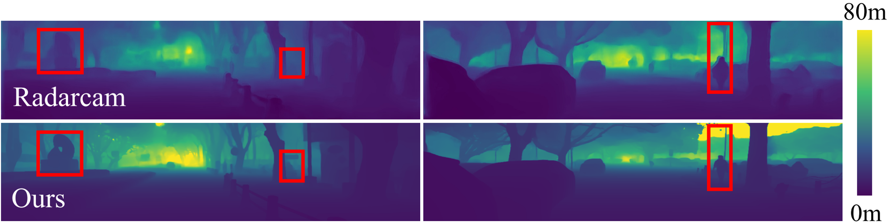

# **RaCalNet: Radar Calibration Network for Sparse-Supervised Dense Depth Estimation**

## 1. Overview

RaCalNet is a novel framework for dense depth estimation using millimeter-wave (mmWave) radar and monocular RGB images, designed to eliminate the reliance on costly dense LiDAR supervision. Unlike previous methods that require dense pseudo ground-truth generated via multi-frame LiDAR fusion and interpolation, RaCalNet learns from sparse single-frame LiDAR, reducing supervision density to just ~1% while maintaining high accuracy.

RaCalNet is composed of two main components:

  

🎯 Radar Recalibration Module
Selects high-quality radar points and refines them through pixel-wise displacement learning, producing reliable, fine-grained depth priors.

📏 Metric Depth Optimization Module
Uses the refined radar priors to calibrate monocular depth predictions by estimating scene-level scale and shift, yielding metrically accurate dense depth maps.

  

Despite relying only on sparse supervision, RaCalNet produces high-quality depth maps with clear object contours and fine-grained geometric details, as shown in the qualitative example above.

## 2.RaCalNet Release Checklist

This checklist outlines the planned public releases for the RaCalNet project.

✅ Planned Releases

- [√] 🏫 **Release our self-collected 4D mmWave radar dataset in campus scenes**

- [ ] 📁 **Release the calibrated ZJU-4DRadarCam dataset**
  - Includes refined sensor extrinsics and consistent projection quality

- [ ] 🧠 **Release the inference code of RaCalNet**
  - Support for single-frame RGB + Radar input
  - Easy-to-use script for depth map generation

- [ ] 🧾 **Release pretrained model weights**
  - Trained on the calibrated ZJU-4DRadarCam dataset
  - Includes instructions for evaluation and benchmarking
     
## 3. Dataset Download

We release the 4D mmWave radar dataset on Hugging Face.

- Dataset name: `gubeisi/4ddataset`
- Direct download (tar.gz, ~4.8 GB):  
  https://huggingface.co/datasets/gubeisi/4ddataset/raw/main/dataset.tar.gz

You can download `dataset.tar.gz` from the link above and extract it locally to reproduce our experiments.
